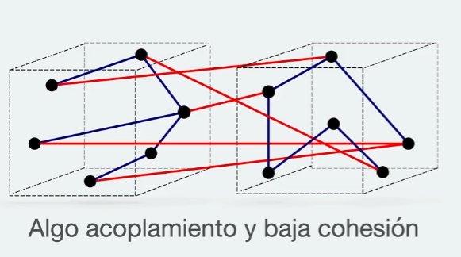
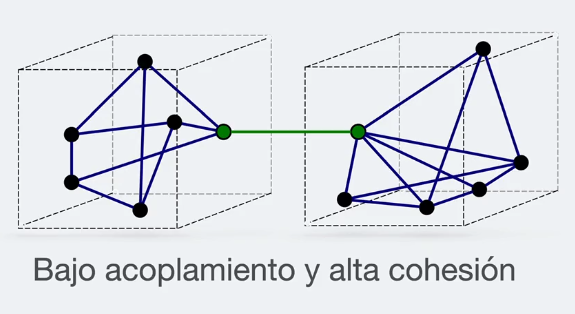

# Definición de conceptos del curso

## Deuda técnica

"Falta de calidad de cierto aspecto de nuestro código"

- puede ser falta de calidad en el codigo o falta de calidad en procesos del software

### Posibles causas

- puede ser que falto documentación
- puede ser que faltaron pruebas
- puede ser que falto una refactorización inicial
- falta de tiempo

La deuda técnica se paga con una refactorización

### ¿Cómo puede afectar una deuda técnica?

#### Costos económicos

- Tiempo en realizar mantenimientos
- Tiempo en refactorizar el código
- Tiempo en comprender el código
- Tiempo adicional en la transferencia del código

# principio DRY

significa "Don´t Repeat Yourself"

* Evitar tener duplicidad en nuestro código.
* Simplifica las pruebas.
* Ayuda a centralizar procesos.
* Usar el principio DRY, generalmente lleva a refactorizar.

# Principio de responsabilidad unica

PRIORIZAR LA COMPOSICIÓN FRENTE A LA HERENCIA

# Acrónimo STUPID

6 Code Smells que debemos de evitar.

1. **Singleton**: patrón singleton.
   PROS:
   - Garantiza una única instancia de la clase a lo largo de toda la aplicación.

  CONTRAS:
    - Vive en el contexto global
    - Puede ser modificado por cualquiera y en cualquier momento.
    - No es rastreable.
    - Difícil de testear debido a su ubicación.

**Tight Coupling**: alto acoplamiento.

    Lo ideal es tener bajo acoplamiento y alta cohesión.
    
    

    ¿Qué es cohesión?
       - **La cohesión se refiere a lo que la clase (o modulo) puede hacer.**
       - La baja cohesión significaría que la clase realiza una gran variedad de acciones: es amplia, no se enfoca en lo que debe hacer.
       - Alta cohesión significa que la clase se enfoca en lo que debería estar haciendo, es decir, solo métodos relacionados con la intención de la clase.

    ¿Qué es acoplamiento?
       - **Se refiere a cuán relacionadas o dependientes son dos clases o módulos entre sí.**
       - **En bajo acoplamiento,** cambiar algo importante en una clase no debería afectar a la otra.
       - **En alto acoplamiento,** dificultaría el cambio y el mantenimiento de su código; dado que las clases están muy unidas, hacer un cambio podría requerir una renovación completa del sistema.

    **UN BUEN DISEÑO DE SOFTWARE TIENE UNA ALTA COHESIÓN Y UN BAJO ACOPLAMIENTO.**

  CONTRAS:
     - Un cambio en un módulo por lo general provoca un efecto dominó de los cambios en otros módulos.  
     - El ensamblaje de módulos puede requerir más esfuerzo y/o tiempo debido a la mayor dependencia entre módulos.
     - Un módulo en particular puede ser más difícil de reutilizar y/o probar porque se deben incluir módulos dependientes.
  
  POSIBLES SOLUCIONES:
     - "A" tiene un atributo que se refiere a “B”.
     - "A" llama a los servicios de un objeto “B”.
     - “A” tiene un método que hace referencia a “B” (a través del tipo de retorno o parámetro).
     - "A" es una subclase de (o implementa) la clase “B”.

**Untestability**: código no probable (unit test).

  Código difícilmente testeable
     - Código con alto acoplamiento.
     - Código con muchas dependencias no inyectadas.
     - Dependencias en el contexto global (Tipo Singleton).
    **Debemos de tener en mente las pruebas desde la creación del código**

**Premature optimization:** optimizaciones prematuras.

     - Mantener abiertas las opciones retrasando la toma de decisiones nos permite darle mayor relevancia a lo que es mas importante en una aplicación.
     - No debemos anticiparnos a los requisitos y desarrollar abstracciones innecesarias que puedan añadir complejidad accidental.
       **Complejidad accidental:** Cuando implementamos una solución compleja a la mínima indispensable.
       **Complejidad esencial:** La complejidad es inherente al problema.
       **DEBE EXISTIR UN BALANCE ENTRE LAS 2!**

**Indescriptive Naming**: nombres poco descriptivos.

     - Nombre de variables mal nombradas.
     - Nombres de clases genéricas.
     - Nombres de funciones mal nombradas.
     - Ser muy especifico o demasiado genérico.

**Duplication**: duplicidad de código, no aplicar el principio DRY.

  **Real:**
    - Código es idéntico y cumple la misma función.
    - Un cambio implica actualizar el mismo código idéntico en varios lugares.
    - Incrementa la posibilidad de error humano al olvidar actualizar una parte de ese código duplicado.
    - Mayor cantidad de pruebas innecesarias.

  **Accidental**
    - Código luce similar pero cumple tareas distintas.
    - Cuando hay un cambio solo hay que modificar un solo lugar.
    - Este tipo de duplicidad se puede trabajar con parámetros u optimizaciones.

  ## Menciones honorificas de otros code-smell

    **Inflación**:
      - Cuando un método contiene demasiadas lineas de código. (más de 10 lineas de código?)
      - Cuando una clase es demasiado grande.

        ¿Por qué es un problema?
          Usualmente siempre se agrega algo a un nuevo método / clase.
        
        ¿Cómo resolverlo?
          Convertir ese método en varios métodos más pequeños.
          Convertir una clase grande en varas clases pequeñas.

      - Obsesión primitiva.
        Signos y síntomas: 
        uso de primitivos en lugar de objetos pequeños para tareas simples cómo manejar datos de monedas, rangos, uso de constantes para codificar información.

        por ejemplo: 
          - tener una constante userAdminRol = 1 (para referirse a que el usuario tiene permisos de admin)
          - uso de constantes de tipo string para el uso de matrices de datos.

        ¿Por qué es un problema?
          - Porque se suele crear al agregar pequeños campos independientes para resolver pequeños problemas rápidamente y eventualmente la clase o método se va a haciendo muy grande y difícil de depurar.

        ¿Cual es el tratamiento?
          - Si tiene una gran cantidad de variables de campos primitivos, agrupar de manera lógica algunos de ellos en su propia clase o método.
          - o aun mejor. mueva el comportamiento asociado a estos a una nueva clase o nuevo método para que esa tarea intente reemplazar dichos valores en un objeto y nos permita en un futuro tener una reutilización de los mismos.
        
      - Lista larga de parámetros

        ¿Cuales son los síntomas?
        Más de 3 o 4 argumentos en una función.
        Listas largas de parámetros puede ser un subproducto de esfuerzos para tratar de hacer que un método haga o se junte para resolver otras necesidades a futuro.

        ¿Por qué es un problema?
        Una lista larga de parámetros puede ocurrir después de fusionar varios tipos de datos  algoritmos en un solo método.

        ¿Cual es el tratamiento?
          - Revisar si todos los parámetros son requeridos o si se pueden eliminar algunos de ellos (no siempre es el caso).
          - Mandar un objeto nuevo con todos los parámetros (aunque no estén relacionados) como un único argumento para la función.
      
      -ACOPLADORES

        - Feature Envy 
          ¿Síntomas?
          Un Objeto accede más a los datos de otro Objeto más que a sus propios datos.

          ¿Por qué es un problema?
          Este olor puede ocurrir después de que los campos se mueven a una u otra clase o se hace una refactorización "no exitosa" o "sin finalizar", porque significaría que ese método no pertenezca a ese lugar.

          ¿Tratamiento?
          Si este es el caso es posible que también desee mover las operaciones sobre los datos de esta clase, modulo o función.
          Cómo regla básica si las cosas cambian al mismo tiempo, debes de mantenerlas en el mismo lugar.
          (nos damos cuenta esta es la mejor solución solo con la practica)

        - Intimidad inapropiada
          ¿Síntomas?
          Cuando una clase usa campos y métodos de otra clase.

          ¿Por qué es un problema?
          Las buenas clases deben de saber lo menos posible de otras clases, esas clases son mas fáciles de mantener y de reutilizar.

          ¿Tratamiento?
          separar métodos y propiedades o hacer de un modulo muy grande un modulo más pequeño. 

        - Cadena de mensajes
          ¿Síntomas?
          Cuando tenemos una función/clase/método 'A' que llama a 'B', que llama a 'C' que llama a 'D'

          ¿Por qué es un problema?
          Cualquier cambio en estas relaciones requiere modificarse nuevamente o añadir un paso

          ¿Tratamiento?
          Crear comunicaciones directas entre 'A' y 'D'

          ¿Qué ganamos?
          Así reducimos la cantidad de dependencias entre clases o módulos. y también se reduce la cantidad de código.

        - The middle man / hombre en el medio
          ¿Síntomas?
          Si una clase realiza una única acción y esa acción es delegar esa acción a otra clase.

          ¿Por qué es un problema?
          Puede ser cuasado por eliminación excesiva de cadenas de mensajes
          **pueden ser desechos de una refactorización que quedo incompleta**

          ¿Tratamiento?
          Las clases deben de tratar de evitar ese punto intermedio porque no queremos tener más funciones de las necesarias en nuestro código.

    
